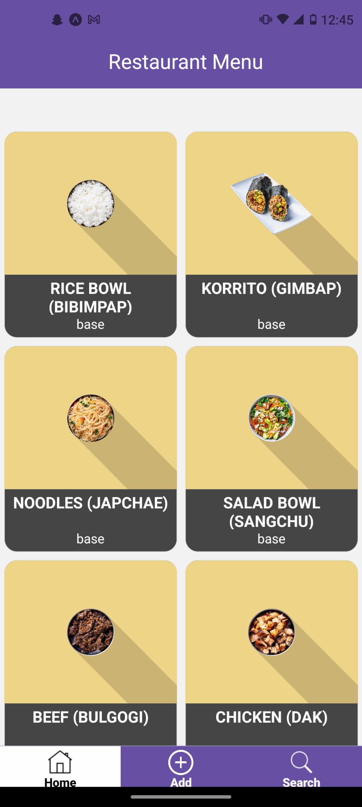
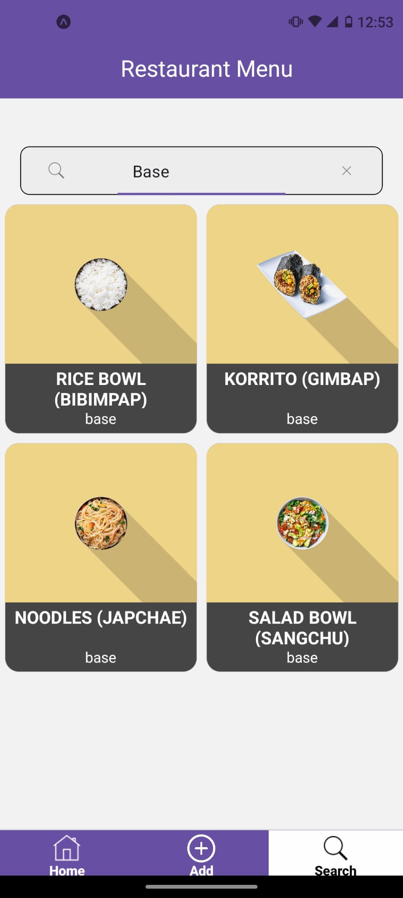
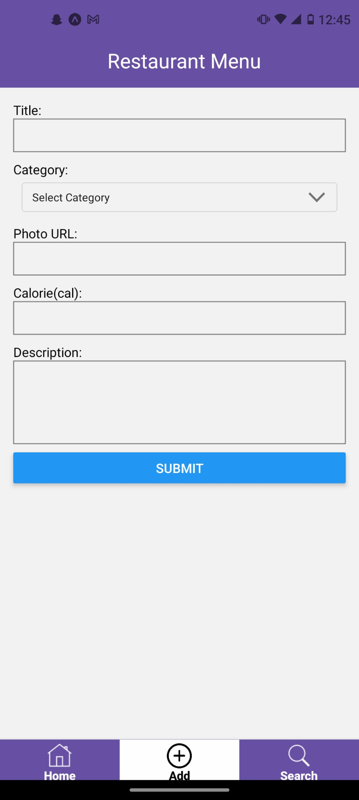

## Overview

This app fetches data from a Google Sheet and displays the information in a user-friendly tile format. Users can add new recipes and search for existing recipes.

## Demo

Check out the demo [here](https://expo.dev/preview/update?message=change%20overall%20UI&updateRuntimeVersion=1.0.0&createdAt=2025-02-02T20%3A05%3A29.259Z&slug=exp&projectId=89212b41-c160-4e67-a63e-d295317c306c&group=20c21d86-cd1e-44db-b7a4-8ba6e0e452c0).

## Documentation
### Getting Started

To run the app, simply run

```npm install && expo start```

And scan the QR code in the Expo client app.
### Technologies Used

- **React Native**: A framework for building native apps using React.
- **SheetDB**: A service that allows you to use Google Sheets as a database.

### Screens
1. **Home Screen**: This is the main screen of the app where users can browse through different recipes.
    
2. **Search Screen**: This screen allows users to search for recipes based on various criteria.
    
3. **Add Screen**: This screen allows users to view and manage their favorite recipes.
    

### Environment Variables

The following environment variables are used in the app:

- `API_URL`: The base URL for the API.
- `API_KEY`: The key used to authenticate requests to the API.
- `SHEETDB_URL`: The URL for the SheetDB service.
For more information on SheetDB, check out the [quickstart guide](https://docs.sheetdb.io/quickstart).


